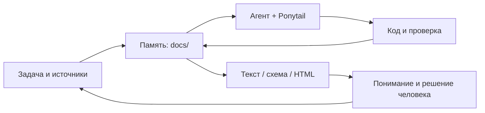

# Czar

**Шаблон для разработки с AI-агентом, который хранит память проекта в Git.**

Ontoship отвечает за поиск и карту знаний. Ponytail помогает выбирать простые решения.
Навык ASD-STE100 помогает писать понятные инструкции и объяснения.
Вы задаёте результат. Агент читает память, меняет код, проверяет работу и обновляет знания.

Это основа для вашего продукта. Язык, фреймворк и способ выпуска вы выбираете при первом задании.

## Быстрый старт

Нужны Git и Python 3.10+ со SQLite FTS5. Пакеты через pip, ключи API и сервер для памяти не нужны.

1. Создайте свой репозиторий из этого шаблона через **Use this template** на GitHub, когда владелец включит этот режим.
2. Склонируйте свой репозиторий и откройте его в инструменте для разработки с AI.
3. Запустите проверку из корня проекта:

```sh
python -S -m unittest discover -s tests -v
python -S scripts/kb.py lint --strict
python -S scripts/kb.py search "память"
```

На Linux и macOS команда может называться `python3`. Используйте её вместо `python` во всех примерах.
Флаг `-S` отключает сторонние пакеты. Для карты он также сохраняет безопасный показ Markdown как текста.
Если FTS5 отсутствует, установите сборку Python с этой возможностью SQLite.

4. Отправьте агенту первый запрос:

```text
Прочитай AGENTS.md и docs/README.md. Используй правила Czar.
Мой продукт: <что создаём и для кого>.
Первая задача: <какой результат нужен пользователю>.
Ограничения: <стек, сроки, платформа или «предложи минимальный вариант»>.
Готово, когда: <наблюдаемое поведение и способ проверки>.
Заполни docs/context.md. Реализуй первую рабочую часть.
Проверь результат и обнови память. Публикацию согласуем отдельно.
```

## Подключение агента

| Инструмент | Точка входа |
|---|---|
| Агент с поддержкой AGENTS.md | [AGENTS.md](AGENTS.md) содержит цикл работы и ссылки на навыки |
| Codex с проектными навыками | `.agents/skills/`; явные вызовы `$ponytail`, `$project-memory`, `$asd-ste100` |
| Claude Code | [CLAUDE.md](CLAUDE.md) подключает те же правила; команды `/ship`, `/kb`, `/ste` |
| Другой агент | Попросите прочитать `AGENTS.md` и нужный `SKILL.md`; CLI работает независимо от агента |

Поддержка автоматического чтения зависит от клиента. Для проверки спросите агента,
где находится текущий контекст и какие файлы он прочитал. Глобальная установка навыков не нужна.

## Что лежит в шаблоне

```text
AGENTS.md                   правила разработки и завершения задачи
.agents/skills/             Ponytail, память, ASD-STE100
docs/README.md              индекс памяти
docs/context.md             цель, состояние, проверки, следующий шаг
docs/decisions/             решения и причины
docs/reference/             процесс, термины, происхождение идей
docs/log.md                 краткая история изменений памяти
sources/                    локальные исходные материалы
scripts/kb.py               вход в CLI Ontoship
vendor/ontoship/            закреплённый исходник Ontoship и его лицензия
tests/                     проверки интеграции
.github/                   CI и шаблоны задачи/PR
```

В Git попадают проверенные знания. Исходные файлы из `sources/` по умолчанию игнорируются.
Поиск и карта читают только `docs/`. Не сохраняйте туда секреты и личные данные.
Память — обычные файлы: агент обновляет их в рамках задачи. Фонового наблюдателя нет.

## Память и карта

```sh
python -S scripts/kb.py index
python -S scripts/kb.py search "решение" --json
python -S scripts/kb.py stat
python -S scripts/kb.py lint --strict
python -S scripts/kb.py map
```

Откройте `docs/docs-map.html` в браузере. Это локальная интерактивная карта со списком файлов и графом связей.
Для просмотра не нужен сервер. Markdown внутри карты показывается как текст при запуске с `-S`.
Индекс `.gitmark/` и HTML создаются заново и не входят в Git.
Поиск пересобирает индекс перед запросом: изменения и удаления заметок видны сразу.
Линтер проверяет структуру, но не доказывает истинность текста и не обнаруживает все противоречия.



## Понятные объяснения

По умолчанию агент пишет кратко и сохраняет язык пользователя.
Навык [asd-ste100](.agents/skills/asd-ste100/SKILL.md) переносит принципы технического упрощения в работу с кодом.
Режим `practical` — свободная адаптация, близкая к идее «80% STE». Это не измерение соответствия стандарту.
Режим `strict` требует английского текста и проверки по официальной спецификации и словарю.
Без этих материалов агент выдаёт черновик и явно указывает, что соответствие не проверено.

```text
$asd-ste100 practical: объясни, как работает память этого проекта.
$asd-ste100 strict: перепиши английскую инструкцию запуска.
Покажи архитектуру схемой Mermaid.
Сделай автономный HTML, если переключение сценариев поможет понять решение.
```

Видео и озвучка — отдельные задачи. Они не входят в начальную установку.

## Развитие шаблона

После первой задачи обновите название, описание и `docs/context.md` под свой продукт.
Добавьте команды проверки продукта в CI, когда появится код продукта.
Текущий CI проверяет только инструменты и память шаблона на Windows и Linux.
Для публикации создайте GitHub-репозиторий, отправьте проверенные файлы и включите **Settings → Template repository**.

Лицензия собственного кода — [MIT](LICENSE). Происхождение зависимостей — [THIRD_PARTY_NOTICES.md](THIRD_PARTY_NOTICES.md).
Основа: [Ontoship](https://github.com/vakovalskii/ontoship).
Вдохновение: [пост Андрея Карпатого](https://x.com/karpathy/status/2105819303471976479),
приложенный пользователем материал LLM Wiki и [ASD-STE100](https://www.asd-ste100.org/).
Подробности и границы проверки источников — [в памяти проекта](docs/reference/sources.md).
